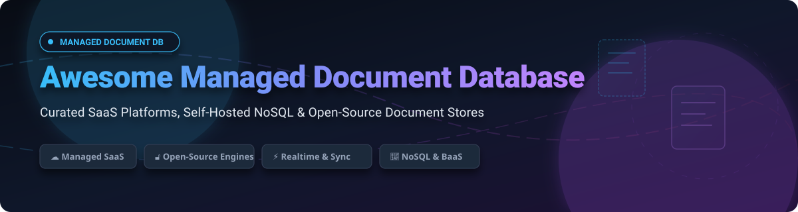

# 🚀 Awesome Managed Document Database

**A curated index of top-tier SaaS Cloud Databases, Self-Hosted NoSQL Solutions, and Open-Source Document Stores.**

---

## 📌 Overview & Key Features

This repository tracks notable **commercial managed document databases** and **open-source software** designed to store, index, and query semi-structured **JSON / BSON documents**. 

Document databases power schema-flexible application backends, content management platforms, real-time synchronization systems, and serverless microservice architectures without requiring complex database schema migrations.

### 🔑 Why Use a Document Database?
- ⚡ **Schema Flexibility**: Store evolving JSON models without downtime or migration scripts.
- 🌐 **Global Distribution**: Instant multi-region replication and serverless auto-scaling.
- 📱 **Real-Time & Offline Sync**: Built-in changefeeds and browser/mobile sync engines (CouchDB, Firestore, RxDB).
- 🧠 **AI & Vector Extensions**: Modern document engines include native vector search for AI RAG applications (MongoDB Atlas, FerretDB).

---

## 📑 Table of Contents

- [☁️ SaaS / Managed Hosted Platforms](#️-saas--managed-hosted-platforms)
- [🔓 Open-Source GitHub Projects](#-open-source-github-projects)
- [🛠️ Selection Guide & Architecture Trade-offs](#️-selection-guide--architecture-trade-offs)
- [🤝 How to Contribute](#-how-to-contribute)
- [⚖️ Disclaimer & Licensing Considerations](#️-disclaimer--licensing-considerations)

---

## ☁️ SaaS / Managed Hosted Platforms

💡 **Market Overview**: The global managed document database sector is estimated at **~$18.5 Billion (2026)** with a **~21% CAGR**. The sector is **moderately concentrated** among cloud hyperscalers (AWS, Azure, Google Cloud) and category-defining database vendors (MongoDB Atlas), while remaining **moderately fragmented** at the developer edge and open-source backend layers.

The following commercial managed document database platforms are sorted by **Company Size / Valuation (Descending)**:

| 🏢 Platform | 📝 Overview & Core Features | 💰 Company Size (Rev / Valuation) | 💵 Starting Price | 🎁 Free Tier Limit |
| :--- | :--- | :--- | :--- | :--- |
| **[Amazon DocumentDB](https://aws.amazon.com/documentdb/)** | **AWS Native Document Store** — Fully managed MongoDB-compatible database with decoupled storage and auto-scaling compute. | **~$575B Rev / ~$2.0T Valuation** *(AWS ~$108B Rev)* | **~$0.08/vCPU hour** *(~$60/month base)* | **30-Day Free Trial**: 750 hrs `db.t3.medium`, 30M I/Os, 5 GB storage, 5 GB backup |
| **[Azure Cosmos DB](https://azure.microsoft.com/en-us/products/cosmos-db/)** | **Global Multi-Model Engine** — Turnkey global distribution with SLA-backed single-digit ms latencies supporting Core SQL & MongoDB APIs. | **~$331.8B Rev / ~$4.0T Valuation** | **$0.025 per 100 RU/s hour** *(~$24/month base)* | **Free Forever**: 1,000 RU/s provisioned throughput & 25 GB storage per subscription |
| **[Google Cloud Firestore](https://cloud.google.com/firestore)** | **Serverless Document Database** — Google's cloud-native NoSQL document DB with offline SDK sync and real-time event streaming. | **~$307B Rev / ~$2.1T Valuation** *(GCP ~$36B Rev)* | **$0.06 / 100K reads, $0.18 / 100K writes** | **Free Forever**: 1 GiB storage, 50,000 reads/day, 20,000 writes/day, 10 GiB egress/month |
| **[Firebase Realtime DB](https://firebase.google.com/products/realtime-database)** | **Real-Time JSON Tree Store** — Low-latency, client-synced JSON tree store tailored for collaborative web and mobile applications. | **~$307B Rev / ~$2.1T Valuation** | **$5.00/GB stored/mo & $1.00/GB downloaded** | **Free Forever (Spark Plan)**: 1 GB storage, 100 concurrent connections, 10 GB bandwidth/mo |
| **[OrientDB Cloud](https://www.orientdb.com/)** | **Multi-Model Graph-Document DB** — Enterprise multi-model database combining document storage, SQL querying, and graph relationships. | **~$34B Rev / ~$260B Valuation** *(Parent: SAP SE)* | **$100.00/month** *(Cloud Enterprise)* | **30-Day Free Trial** for Enterprise Cloud; Self-hosted Community Edition is 100% Free |
| **[Couchbase Capella](https://www.couchbase.com/products/capella/)** | **Managed NoSQL & Edge Sync** — High-performance document store with SQL++ querying, in-memory caching, and mobile edge sync. | **~$252M ARR / $1.5B Valuation** *(Haveli Investments)* | **$0.34/node hour** *(~$245/month)* | **Free Forever**: Single 8GB node cluster (paused during inactivity, no credit card needed) |
| **[MongoDB Atlas](https://www.mongodb.com/atlas)** | **Category-Leading Document SaaS** — Managed MongoDB across AWS, Azure, GCP with Atlas Vector Search & Stream Processing. | **~$1.8B Rev / ~$22B Valuation** *(NASDAQ: MDB)* | **$0.08/hour** *(~$57/month dedicated)* / $30 Flex | **Free Forever (M0 Cluster)**: 512 MB storage, shared RAM/vCPU, 500 concurrent connections |
| **[RavenDB Cloud](https://ravendb.net/cloud)** | **ACID Transactional NoSQL** — Managed RavenDB featuring strict ACID transactions, dynamic auto-indexing, and full-text search. | **~$10M Rev / ~$50M Valuation** *(Hibernating Rhinos)* | **$0.07/hour** *(~$50/month Developer)* | **Free Forever**: $14/month credit (1 free node: 2 vCPU, 500 MB RAM, 10 GB storage) |
| **[HarperDB Cloud](https://harperdb.io/)** | **Distributed Document Platform** — Hybrid document store and edge application delivery platform running on custom storage engine. | **~$5.2M Rev / $24M Raised** *(Serent Capital)* | **$19.99/month** per cloud instance block | **Free Forever**: 1 cloud instance block (0.5 GB RAM, 1 GB storage) for dev workloads |
| **[Fauna](https://fauna.com/)** | *[Defunct]* — Former serverless global document database with ACID transactions and GraphQL API. | **Defunct** *(Shut down May 2025; $60M Raised)* | **Service Sunsetted** | **Defunct**: Service shut down permanently on May 30, 2025 |

---

## 🔓 Open-Source GitHub Projects

The open-source ecosystem provides powerful document stores, offline synchronization engines, and Backend-as-a-Service (BaaS) platforms. 

All open-source repositories below are sorted strictly by **GitHub Star Counts (Descending)**:

1. **[Supabase](https://github.com/supabase/supabase)**   
   **The Open-Source Firebase Alternative** *(License: Apache-2.0)*  
   PostgreSQL-backed platform featuring native JSONB document columns, real-time change subscriptions, built-in Auth, serverless Edge Functions, and vector search.

2. **[NocoDB](https://github.com/nocodb/nocodb)**   
   **Open-Source Airtable Alternative** *(License: AGPL-3.0)*  
   Transforms any relational database into a smart spreadsheet, providing structured document storage with grid, gallery, kanban views, and instant REST/GraphQL APIs.

3. **[PocketBase](https://github.com/pocketbase/pocketbase)**   
   **Open-Source Realtime Backend in 1 File** *(License: MIT)*  
   Single-file Go executable embedding an SQLite database with JSON document support, real-time subscription websockets, auth management, and admin UI.

4. **[Meilisearch](https://github.com/meilisearch/meilisearch)**   
   **Ultra-Fast Open-Source Document Search Engine** *(License: MIT)*  
   Lightning-fast, typo-tolerant search engine API optimized for indexing and retrieving semi-structured JSON documents with instantaneous results.

5. **[Appwrite](https://github.com/appwrite/appwrite)**   
   **Open-Source Backend-as-a-Service Platform** *(License: BSD-3-Clause)*  
   Complete developer platform offering DocumentsDB for schema-free JSON document storage, authentication, object storage, serverless functions, and vector search.

6. **[Directus](https://github.com/directus/directus)**   
   **Open-Source Headless CMS & Data Platform** *(License: BSL-1.1)*  
   Provides instant REST and GraphQL APIs over any SQL database with flexible JSON document fields, access permissions, and a customizable admin interface.

7. **[SurrealDB](https://github.com/surrealdb/surrealdb)**   
   **Multi-Model Document-Graph Database** *(License: BSL-1.1)*  
   Cloud-native database combining document, graph, key-value, and vector capabilities into a single engine with real-time SurrealQL queries.

8. **[MongoDB Community Edition](https://github.com/mongodb/mongo)**   
   **The Original Document Database Leader** *(License: SSPL)*  
   The industry-standard NoSQL document store featuring flexible JSON-like BSON documents, a rich aggregation pipeline, sharding, and replica set high availability.

9. **[RethinkDB](https://github.com/rethinkdb/rethinkdb)**   
   **Real-Time Document Database** *(License: Apache-2.0)*  
   Distributed document database designed for real-time web applications, pushing changefeed query updates straight to clients as JSON data changes.

10. **[Typesense](https://github.com/typesense/typesense)**   
    **Open-Source Algolia Alternative** *(License: GPL-3.0)*  
    Fast, in-memory document search engine built from the ground up for typo tolerance, instant search, and intuitive faceted filtering over JSON documents.

11. **[RxDB](https://github.com/pubkey/rxdb)**   
    **Local-First Offline-First Reactive Database** *(License: Apache-2.0)*  
    Reactive JavaScript document database for browsers, Node.js, and mobile apps that automatically synchronizes state with backend document stores.

12. **[lowdb](https://github.com/typicode/lowdb)**   
    **Minimalist Local JSON Database** *(License: MIT)*  
    Zero-dependency, small JSON file database ideal for Node.js scripts, electron apps, and lightweight embedded local state storage.

13. **[PouchDB](https://github.com/pouchdb/pouchdb)**   
    **Pocket-Sized Sync Database** *(License: Apache-2.0)*  
    In-browser JavaScript database engineered to run offline inside web applications and continuously replicate with Apache CouchDB.

14. **[ArangoDB Community](https://github.com/arangodb/arangodb)**   
    **Native Multi-Model Engine** *(License: Apache-2.0)*  
    Combines documents, graph networks, and key-value stores within a unified core engine operated by the SQL-like AQL query language.

15. **[NeDB](https://github.com/louischatriot/nedb)**   
    **Embedded JavaScript Document Store** *(License: MIT)*  
    Embedded document database for Node.js, NW.js, and Electron implementing a subset of MongoDB's API for local file persistence.

16. **[WatermelonDB](https://github.com/Nozbe/WatermelonDB)**   
    **High-Performance React Native Database** *(License: MIT)*  
    Reactive database framework for React Native & React web apps designed to render tens of thousands of document records lazily without UI lag.

17. **[FerretDB](https://github.com/FerretDB/FerretDB)**   
    **Open-Source MongoDB Replacement** *(License: Apache-2.0)*  
    Open-source MongoDB-compatible database proxy backed by PostgreSQL (using DocumentDB extension) or SQLite, allowing standard MongoDB driver compatibility without SSPL license lock-in.

18. **[LiteDB](https://github.com/litedb-org/LiteDB)**   
    **Embedded .NET NoSQL Document Store** *(License: MIT)*  
    Lightweight, single-file embedded BSON document database for .NET applications with thread-safe ACID operations and indexing.

19. **[Apache CouchDB](https://github.com/apache/couchdb)**   
    **Offline-First Sync Engine** *(License: Apache-2.0)*  
    Document database equipped with a RESTful HTTP/JSON API, JavaScript Map/Reduce views, and fault-tolerant multi-primary sync capabilities.

20. **[LokiJS](https://github.com/techfort/LokiJS)**   
    **Fast In-Memory JavaScript Database** *(License: MIT)*  
    In-memory document store prioritizing query performance for Node.js, Cordova, and browser single-page applications.

21. **[OrientDB Community](https://github.com/orientechnologies/orientdb)**   
    **Multi-Model Graph & Document DB** *(License: Apache-2.0)*  
    Distributed multi-model database supporting ACID transactions, graph edge relationships, and full-text search.

22. **[RavenDB](https://github.com/ravendb/ravendb)**   
    **Transactional NoSQL Document Engine** *(License: AGPL-3.0)*  
    Fully ACID-compliant document store featuring automatic indexing, full-text search queries, and distributed cluster topology.

23. **[DocumentDB Extension](https://github.com/documentdb/documentdb)**   
    **PostgreSQL Document Storage Extension** *(License: PostgreSQL License)*  
    Brings native BSON datatypes, MongoDB query primitives, and document storage directly inside PostgreSQL databases.

---

## 🛠️ Selection Guide & Architecture Trade-offs

- **For Enterprise Cloud Workloads**: Choose **MongoDB Atlas** or **Amazon DocumentDB** / **Azure Cosmos DB** for SLA-backed auto-scaling and global multi-region compliance.
- **For Open-Source Compliance (Avoiding SSPL)**: Deploy **FerretDB** over PostgreSQL to maintain standard MongoDB driver compatibility with 100% OSI-approved Apache-2.0 licensing.
- **For Mobile & Offline-First Web Sync**: Combine **Apache CouchDB** with **PouchDB** or use **RxDB** / **WatermelonDB** for client-side local caching and background state replication.
- **For Rapid BaaS & Application Backends**: Choose **Supabase**, **PocketBase**, or **Appwrite** for out-of-the-box authentication, instant APIs, file storage, and document database primitives.

---

## 🤝 How to Contribute

Contributions are warmly welcome! If you know of a managed document database platform or open-source project that should be listed:

1. **Fork** this repository.
2. Add your entry to `README.md` keeping formatting consistent (include name, links, description, licensing, pricing, and exact star badges).
3. Open a **Pull Request** with a clear explanation of the addition.

---

## ⚖️ Disclaimer & Licensing Considerations

- **Community Curated**: This is a community-maintained resource list and does not constitute an endorsement.
- **Licensing Awareness**: Pay close attention to database licensing models:
  - **OSI Open-Source**: Apache-2.0 (FerretDB, CouchDB, ArangoDB), MIT (PocketBase, Meilisearch, RxDB), BSD-3-Clause (Appwrite).
  - **Non-OSI Source-Available**: SSPL (MongoDB Community Edition), BSL (Directus, SurrealDB).
- **Data Security**: Self-hosted document stores require administrative security hardening, TLS encryption in transit, encryption at rest, and regular backup strategies.

---

**Made with ❤️ for backend engineers, system architects, and software developers.**

